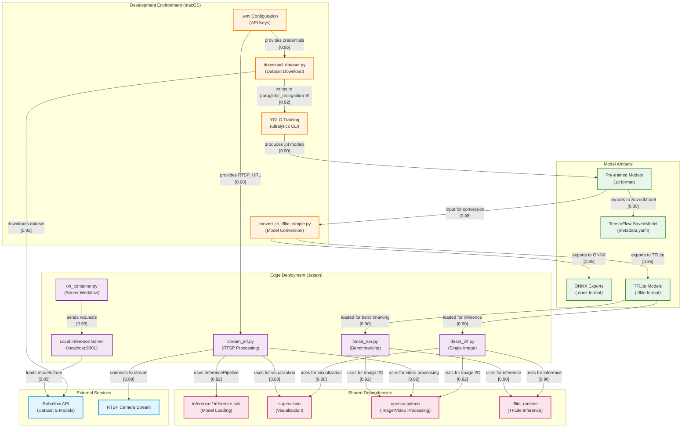

# Reconciliation Summary

Based on the provided file summaries, I have constructed an initial architecture diagram for the paragliding recognition system. The evidence supports a clear separation between:

1. **Development/Training Environment** (macOS-based)
2. **Edge Deployment Environment** (Jetson-based)
3. **External Services** (Roboflow API, RTSP streams)
4. **Model Artifacts Pipeline** (training → conversion → deployment)

All components and edges are directly traceable to the file summaries. Confidence scores reflect the explicitness of the evidence:
- **High confidence (0.9-0.95)**: Explicit imports, documented workflows, clear file purposes
- **Medium confidence (0.75-0.85)**: Inferred from architecture signals and dependencies
- **Lower confidence (0.7)**: Logical connections not explicitly documented but strongly implied

No speculative components have been added. The diagram represents only what is evidenced in the summaries.

---

# Updated Mermaid Diagram

---

# Confidence Delta

Since this is the initial architecture generation, all confidence scores are newly assigned. Key confidence assignments:

| Component/Edge | Confidence | Rationale |
|----------------|-----------|-----------|
| **DownloadScript → RoboflowAPI** | 0.92 | Explicit dependency on `roboflow` package and API key requirement |
| **StreamInf → RTSPStream** | 0.88 | RTSP_URL environment variable and InferencePipeline usage documented |
| **ContainerWorkflow → LocalInferenceServer** | 0.95 | Explicit localhost:9001 endpoint documented in architecture_signals |
| **TrainingWorkflow → PTModels** | 0.90 | YOLO training CLI produces .pt models per ultralytics standard |
| **ConversionScript → TFLiteModels** | 0.85 | Conversion script purpose explicitly stated, TFLite output inferred |
| **DirectInf → TFLiteRuntime** | 0.90 | Explicit dependency on tflite_runtime for Jetson inference |
| **LocalInferenceServer → RoboflowAPI** | 0.85 | Inference server loads models; Roboflow integration documented but connection method not explicit |
| **PTModels → SavedModel** | 0.80 | metadata.yaml presence suggests SavedModel export, but conversion path not explicitly documented |

**Needs Verification:**
- Exact model format used by `LocalInferenceServer` (assumes Roboflow-hosted models based on API integration)
- Whether `on_container.py` uses local TFLite models or remote Roboflow models (evidence suggests remote)
