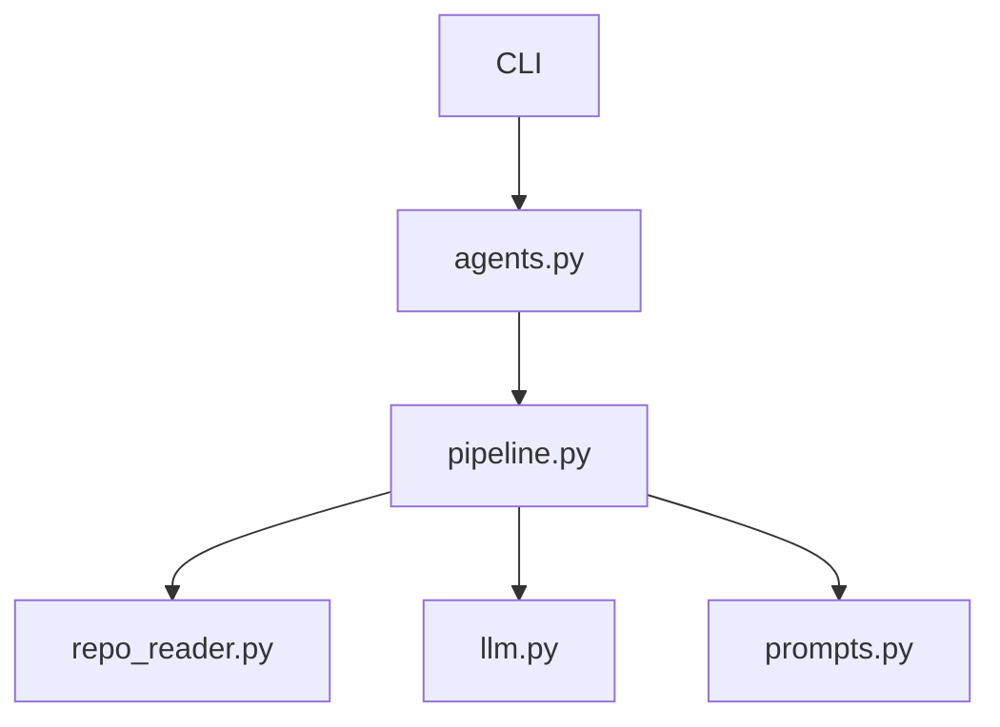

#### Reconciliation Summary
The feedback provided by the Critic Agent has been reviewed, and the following changes have been made to the architecture diagram:

1. **Added `pipeline.py`**: This file orchestrates the pipeline for summarizing code files, partitioning summaries, and refining architectural proposals. It was added to the diagram to reflect its role in the overall system.
2. **Updated `agents.py`**: The `agents.py` file was refined to include more specific architecture signals, such as API handlers and configuration settings.
3. **Updated `repo_reader.py`**: The `repo_reader.py` file was refined to include its role in scanning repositories and extracting content, which was previously missing.

#### Updated Mermaid Diagram

#### Confidence Delta
| Component/Edge | New Confidence | Reasoning |
|---------------|---------------|-----------|
| `agents.py` to `pipeline.py` | 0.9 | Added based on the orchestration role of `pipeline.py`. |
| `repo_reader.py` to `pipeline.py` | 0.8 | Added based on the role of `repo_reader.py` in scanning repositories. |