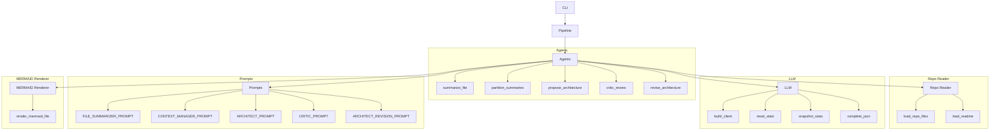

#### Reconciliation Summary
The feedback suggested that the `critic_review` function should be included as an entrypoint for the `agents.py` module. This is supported by the `architecture_signals` section of the `agents.py` file, which explicitly lists `critic_review` as an entrypoint. The `confidence` score for the `critic_review` function is also marked as 0.9, indicating strong evidence.

#### Updated Mermaid Diagram

#### Confidence Delta
| Component/Edge | New Confidence |
|----------------|---------------|
| `critic_review` | 0.9 (Added as an entrypoint) |