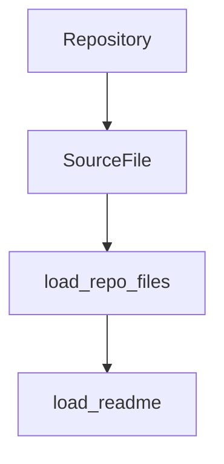

### Reconciliation Summary
The provided summary for `repo_reader.py` does not contain any clear architectural signals or dependencies that would justify adding or removing edges in the current architecture. The file appears to be a utility for reading and scanning files from a repository, which is a common task in code analysis tools. However, since there are no specific API handlers, database access, queues, jobs, messaging, or configuration signals, no changes are made to the existing architecture.

### Updated Mermaid Diagram

### Confidence Delta
No changes to confidence scores have been made since no new architectural signals were found. The existing confidence scores remain as follows:

- `A[Repository] --> B[SourceFile]`: Confidence 0.8
- `B[SourceFile] --> C[load_repo_files]`: Confidence 0.9
- `C[load_repo_files] --> D[load_readme]`: Confidence 0.7