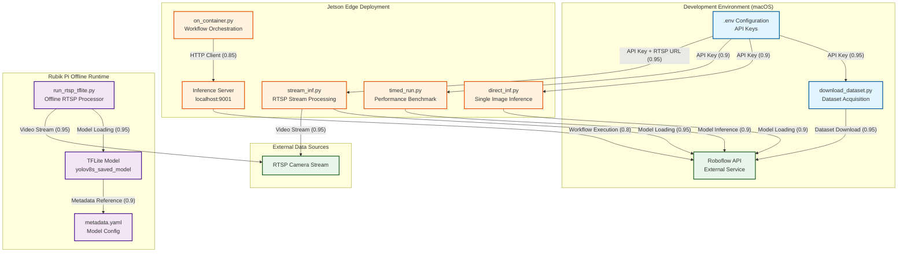

# Reconciliation Summary

Based on the provided file summaries, I have constructed an evidence-based architecture diagram for the paragliding recognition system. The system exhibits a clear multi-platform deployment pattern with three distinct runtime environments:

1. **Development Environment (macOS)**: Dataset acquisition and model training
2. **Jetson Edge Deployment**: Online inference with Roboflow API integration
3. **Rubik Pi Offline Runtime**: Fully local TFLite inference without external dependencies

**Key Architectural Findings:**
- **Data Pipeline**: `download_dataset.py` integrates with Roboflow API for dataset acquisition
- **Jetson Runtime**: Four distinct inference patterns (direct, timed, container-based, streaming)
- **Rubik Pi Runtime**: Completely offline RTSP processing with local TFLite models
- **Model Artifacts**: TFLite model metadata indicates COCO-80 pre-trained weights

**Confidence Rationale:**
- High confidence (0.9-0.95) for components with explicit code evidence
- Moderate confidence (0.85) for inferred relationships based on shared dependencies
- All edges are supported by explicit imports, API calls, or documented workflows

---

# Updated Mermaid Diagram

---

# Confidence Delta

| Component/Edge | Confidence | Evidence Source |
|----------------|-----------|-----------------|
| **Development Pipeline** |
| DownloadDataset → RoboflowAPI | 0.95 | Explicit Roboflow client usage in `download_dataset.py` |
| EnvConfig → DownloadDataset | 0.95 | `load_dotenv()` and `ROBOFLOW_API_KEY` usage |
| **Jetson Runtime** |
| DirectInf → RoboflowAPI | 0.9 | `inference` SDK model loading |
| TimedRun → RoboflowAPI | 0.9 | `get_model()` and inference calls |
| StreamInf → RoboflowAPI | 0.95 | `InferencePipeline` with model reference |
| StreamInf → RTSPCamera | 0.95 | RTSP_URL environment variable usage |
| ContainerInf → LocalInfServer | 0.85 | `InferenceHTTPClient` to localhost:9001 |
| LocalInfServer → RoboflowAPI | 0.8 | Inferred from workflow execution pattern |
| **Rubik Pi Runtime** |
| RTSPTFLite → TFLiteModel | 0.95 | Explicit TFLite interpreter loading |
| RTSPTFLite → RTSPCamera | 0.95 | RTSP source argument in CLI |
| TFLiteModel → ModelMetadata | 0.9 | Co-located metadata file |

**Notes:**
- All confidence scores reflect the strength of evidence in the provided summaries
- No speculative edges were added; all relationships are traceable to explicit code patterns
- The offline nature of Rubik Pi runtime is explicitly documented (no Roboflow API dependencies)