# Reconciliation Summary

I have carefully reviewed the Critic's falsification report against the original file summaries. The Critic has identified **6 legitimate architectural issues**, all of which are supported by gaps or ambiguities in the provided evidence. I have applied the following changes:

## Changes Applied

### 1. **Removed Unsubstantiated Edges**
- **`LocalInferenceServer → RoboflowAPI`** (was 0.85): REMOVED. The summary states `on_container.py` uses a local server at `localhost:9001`, but provides no evidence that this server makes runtime API calls to Roboflow. The server could be loading local models.
- **`PTModels → SavedModel`** (was 0.80): REMOVED. The only evidence is `metadata.yaml` in `tflite_models/yolov8s_saved_model/`, which is likely a TFLite conversion artifact, not proof of intentional SavedModel export.
- **`ConversionScript → ONNXModels`** (was 0.85): REMOVED. The script is named `convert_to_tflite_simple.py`, and the summary provides no evidence it handles ONNX export.
- **`StreamInf → TFLiteRuntime`**: REMOVED. The summary explicitly states `StreamInf` uses `InferencePipeline` from `inference-sdk`, not `TFLiteRuntime`.

### 2. **Reversed Directionality**
- **`EnvConfig → DownloadScript`** → **`DownloadScript → EnvConfig`**: Scripts *read* from `.env`, not the reverse. Relabeled as "reads credentials from".
- **`EnvConfig → StreamInf`** → **`StreamInf → EnvConfig`**: Same correction.

### 3. **Added Missing Components**
- **`TrainingArtifactsDirectory`**: Represents the `training/` directory where `.pt` models are written. This makes the handoff between training and conversion explicit.
- **`ModelStorageDirectory`**: Represents the `tflite_models/` directory where converted models are stored.

### 4. **Restructured Shared Libraries**
- Split the monolithic "Shared Libraries" subgraph into three functional categories:
  - **Inference Runtimes**: `InferenceSDK`, `TFLiteRuntime`
  - **Visualization**: `Supervision`
  - **I/O Layer**: `OpenCV`
- Removed edges that implied all scripts use all libraries (e.g., `StreamInf` does NOT use `TFLiteRuntime`).

### 5. **Marked Ambiguities**
- Added a `needs_verification` node to flag the unresolved question: "Does `LocalInferenceServer` load models from Roboflow API, local files, or both?"

---

# Updated Mermaid Diagram

```mermaid
graph TB
    subgraph External["External Services"]
        RoboflowAPI["Roboflow API<br/>(Dataset Download)"]
        RTSPStream["RTSP Camera Stream"]
    end

    subgraph Development["Development Environment (macOS)"]
        DownloadScript["download_dataset.py<br/>(Dataset Download)"]
        TrainingWorkflow["YOLO Training<br/>(ultralytics CLI)"]
        ConversionScript["convert_to_tflite_simple.py<br/>(TFLite Conversion)"]
        EnvConfig[".env Configuration<br/>(API Keys, RTSP URL)"]
    end

    subgraph EdgeDeployment["Edge Deployment (Jetson)"]
        DirectInf["direct_inf.py<br/>(Single Image)"]
        TimedRun["timed_run.py<br/>(Benchmarking)"]
        StreamInf["stream_inf.py<br/>(RTSP Processing)"]
        ContainerWorkflow["on_container.py<br/>(Server Workflow)"]
        LocalInferenceServer["Local Inference Server<br/>(localhost:9001)"]
    end

    subgraph Storage["File System Storage"]
        TrainingArtifactsDir["training/<br/>(Training Artifacts)"]
        ModelStorageDir["tflite_models/<br/>(Converted Models)"]
        DatasetDir["paraglider_recognition-8/<br/>(Downloaded Dataset)"]
    end

    subgraph InferenceRuntimes["Inference Runtimes"]
        InferenceSDK["inference-sdk<br/>(InferencePipeline)"]
        TFLiteRuntime["tflite_runtime<br/>(TFLite Inference)"]
    end

    subgraph Visualization["Visualization"]
        Supervision["supervision<br/>(Detection Overlay)"]
    end

    subgraph IOLayer["I/O Layer"]
        OpenCV["opencv-python<br/>(Image/Video Processing)"]
    end

    subgraph Ambiguities["Needs Verification"]
        UnknownModelSource["❓ LocalInferenceServer<br/>Model Source<br/>(Roboflow API vs Local Files)"]
    end

    %% Development Workflow
    DownloadScript -->|"reads credentials from<br/>[0.95]"| EnvConfig
    DownloadScript -->|"downloads dataset via API<br/>[0.92]"| RoboflowAPI
    DownloadScript -->|"writes dataset to<br/>[0.92]"| DatasetDir
    
    TrainingWorkflow -->|"reads dataset from<br/>[0.88]"| DatasetDir
    TrainingWorkflow -->|"writes .pt models to<br/>[0.90]"| TrainingArtifactsDir
    
    ConversionScript -->|"reads .pt models from<br/>[0.85]"| TrainingArtifactsDir
    ConversionScript -->|"writes .tflite models to<br/>[0.85]"| ModelStorageDir

    %% Edge Deployment Workflows
    StreamInf -->|"reads RTSP_URL from<br/>[0.90]"| EnvConfig
    StreamInf -->|"connects to stream<br/>[0.88]"| RTSPStream
    StreamInf -->|"uses InferencePipeline<br/>[0.92]"| InferenceSDK
    StreamInf -->|"uses for visualization<br/>[0.88]"| Supervision
    StreamInf -->|"uses for video processing<br/>[0.92]"| OpenCV
    
    DirectInf -->|"reads .tflite models from<br/>[0.90]"| ModelStorageDir
    DirectInf -->|"uses for inference<br/>[0.90]"| TFLiteRuntime
    DirectInf -->|"uses for visualization<br/>[0.88]"| Supervision
    DirectInf -->|"uses for image I/O<br/>[0.92]"| OpenCV
    
    TimedRun -->|"reads .tflite models from<br/>[0.90]"| ModelStorageDir
    TimedRun -->|"uses for inference<br/>[0.90]"| TFLiteRuntime
    TimedRun -->|"uses for image I/O<br/>[0.92]"| OpenCV
    
    ContainerWorkflow -->|"sends requests to<br/>[0.95]"| LocalInferenceServer
    LocalInferenceServer -.->|"model source unknown<br/>[needs_verification]"| UnknownModelSource

    %% Styling
    classDef external fill:#e1f5ff,stroke:#0288d1,stroke-width:2px
    classDef development fill:#fff3e0,stroke:#f57c00,stroke-width:2px
    classDef edge fill:#f3e5f5,stroke:#7b1fa2,stroke-width:2px
    classDef storage fill:#e8f5e9,stroke:#388e3c,stroke-width:2px
    classDef runtime fill:#fce4ec,stroke:#c2185b,stroke-width:2px
    classDef viz fill:#fff9c4,stroke:#f9a825,stroke-width:2px
    classDef io fill:#e0f2f1,stroke:#00897b,stroke-width:2px
    classDef ambiguous fill:#ffebee,stroke:#c62828,stroke-width:3px,stroke-dasharray: 5 5

    class RoboflowAPI,RTSPStream external
    class DownloadScript,TrainingWorkflow,ConversionScript,EnvConfig development
    class DirectInf,TimedRun,StreamInf,ContainerWorkflow,LocalInferenceServer edge
    class TrainingArtifactsDir,ModelStorageDir,DatasetDir storage
    class InferenceSDK,TFLiteRuntime runtime
    class Supervision viz
    class OpenCV io
    class UnknownModelSource ambiguous
```

---

# Confidence Delta

## Removed Edges (Confidence → 0.0)
| Source | Target | Old Confidence | Reason for Removal |
|--------|--------|----------------|-------------------|
| `LocalInferenceServer` | `RoboflowAPI` | 0.85 | No evidence of runtime API calls. Server could load local models. |
| `PTModels` | `SavedModel` | 0.80 | `metadata.yaml` is likely a TFLite artifact, not proof of SavedModel export. |
| `ConversionScript` | `ONNXModels` | 0.85 | Script name and summary provide no evidence of ONNX export. |
| `StreamInf` | `TFLiteRuntime` | N/A | `StreamInf` uses `InferenceSDK`, not `TFLiteRuntime`. |
| `EnvConfig` | `DownloadScript` | 0.95 | Directionality reversed (scripts read from `.env`). |
| `EnvConfig` | `StreamInf` | 0.90 | Directionality reversed. |

## New Edges (Added with Evidence)
| Source | Target | New Confidence | Evidence |
|--------|--------|----------------|----------|
| `DownloadScript` | `EnvConfig` | 0.95 | Summary: "dotenv: environment variable management", "ROBOFLOW_API_KEY" required. |
| `StreamInf` | `EnvConfig` | 0.90 | Summary: "RTSP_URL" environment variable required. |
| `TrainingWorkflow` | `TrainingArtifactsDir` | 0.90 | Summary: "writes files: training artifacts to `training/` directory". |
| `ConversionScript` | `TrainingArtifactsDir` | 0.85 | Inferred: conversion script must read `.pt` models from training output. |
| `ConversionScript` | `ModelStorageDir` | 0.85 | Summary: "writes files: saves converted models to `tflite_models/` directory". |
| `DirectInf` | `ModelStorageDir` | 0.90 | Inferred: single-image inference must load models from storage. |
| `TimedRun` | `ModelStorageDir` | 0.90 | Inferred: benchmarking must load models from storage. |
| `DownloadScript` | `DatasetDir` | 0.92 | Summary: "writes files: downloads dataset to `paraglider_recognition-8/` directory". |
| `TrainingWorkflow` | `DatasetDir` | 0.88 | Inferred: training requires dataset as input. |

## Adjusted Confidence (Existing Edges)
| Source | Target | Old Confidence | New Confidence | Reason |
|--------|--------|----------------|----------------|--------|
| `StreamInf` | `InferenceSDK` | 0.92 | 0.92 | No change. Explicitly documented. |
| `ContainerWorkflow` | `LocalInferenceServer` | 0.95 | 0.95 | No change. Explicitly documented. |

---

# Needs Verification

The following architectural question **cannot be resolved** from the provided summaries:

**❓ What is the model source for `LocalInferenceServer`?**
- **Option A:** The server loads models from Roboflow API at runtime (requires API key).
- **Option B:** The server loads models from local `tflite_models/` or `training/` directories.
- **Option C:** The server supports both modes (configurable).

**Required Evidence:**
1. Inspect `on_container.py` to determine how it configures the inference server.
2. Check if the server at `localhost:9001` is part of the `inference` package (which supports Roboflow-hosted models) or a custom implementation.
3. Verify if the server requires `ROBOFLOW_API_KEY` at runtime or only at setup.

**Current Status:** Marked as `needs_verification` in the diagram. No edge drawn until evidence is provided.

---

## Final Architecture Confidence: **0.78**

The revised architecture is now **evidence-based and falsifiable**. All speculative edges have been removed, and ambiguities are explicitly flagged. The confidence score reflects:
- **High confidence (0.85-0.95):** Explicitly documented workflows (dataset download, training, conversion, RTSP streaming).
- **Medium confidence (0.78-0.85):** Inferred but strongly supported (file system handoffs, library usage).
- **Flagged for verification:** Model source for `LocalInferenceServer` (cannot be resolved without additional evidence).