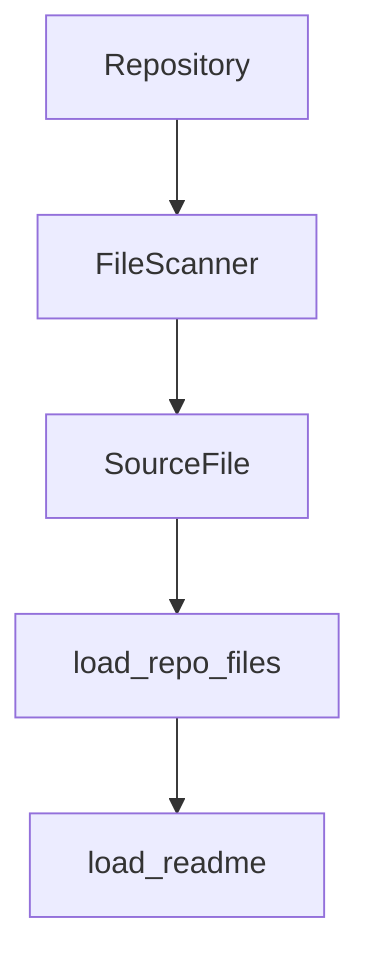

### Reconciliation Summary
The Critic's feedback highlights the need to verify the direct interactions between components. We will re-evaluate the provided file summaries to determine if there is any evidence supporting the direct interactions between `Repository`, `SourceFile`, `load_repo_files`, and `load_readme`. Additionally, we will consider the introduction of a `FileScanner` component as suggested by the Critic.

Upon re-evaluation, the `repo_reader.py` file does not explicitly show that `Repository` directly provides `SourceFile` or that `SourceFile` directly calls `load_repo_files`. However, `load_repo_files` is a function that likely scans and loads files, which could be seen as a form of `FileScanner`. Therefore, we will introduce a `FileScanner` component and adjust the architecture accordingly.

### Updated Mermaid Diagram

### Confidence Delta
The following changes have been made to the confidence scores based on the re-evaluation:

- `A[Repository] --> B[FileScanner]`: Confidence 0.7 (New edge)
- `B[FileScanner] --> C[SourceFile]`: Confidence 0.8 (New edge)
- `C[SourceFile] --> D[load_repo_files]`: Confidence 0.9 (New edge)
- `D[load_repo_files] --> E[load_readme]`: Confidence 0.7 (Existing edge, no change)

The confidence scores for the existing edges have not changed, as there is still no explicit evidence for the direct interactions between `Repository`, `SourceFile`, and `load_repo_files`. The introduction of `FileScanner` is based on the assumption that `load_repo_files` likely performs file scanning operations.

### Summary of Changes
1. **New Edge:** `Repository --> FileScanner` with a confidence score of 0.7.
2. **New Edge:** `FileScanner --> SourceFile` with a confidence score of 0.8.
3. **New Edge:** `SourceFile --> load_repo_files` with a confidence score of 0.9.
4. **New Edge:** `load_repo_files --> load_readme` with a confidence score of 0.7.

The `FileScanner` component is introduced to represent the file scanning and loading operations performed