# Reconciliation Summary

After careful re-examination of the original file summaries against the Critic's feedback, I have made the following evidence-based adjustments:

## Changes Made

### 1. **Removed Speculative Components**
- **Removed:** `LocalInfServer` as a standalone deployed component
- **Reasoning:** The summaries show `on_container.py` creates an HTTP client to `localhost:9001`, but provide **zero evidence** of server deployment scripts, Docker configurations, or startup processes. The client code proves *intent to connect*, not that the server exists in this codebase.
- **Action:** Converted to an external dependency annotation rather than an internal component.

### 2. **Downgraded Roboflow API Edge Confidences**
- **Adjusted:** All Jetson → RoboflowAPI edges reduced by 0.15-0.25 points
- **Reasoning:** The summaries confirm SDK usage (`inference`, `get_model()`) but do not provide evidence of:
  - Direct cloud API calls vs. local caching
  - Network traces showing `api.roboflow.com` requests
  - Offline capability after initial model download
- **Action:** Relabeled edges as "SDK Integration (caching unknown)" to reflect uncertainty.

### 3. **Removed Unverified TFLite Metadata Edge**
- **Removed:** `TFLiteModel → ModelMetadata` edge
- **Reasoning:** The `run_rtsp_tflite.py` summary explicitly mentions loading labels from an "optional labels file" via `--labels` argument, but shows **no code** that parses `metadata.yaml`. The YAML file may be documentation-only.
- **Action:** Removed edge; kept `ModelMetadata` as a documentation artifact without runtime dependency.

### 4. **Added Missing Pipeline Components (Marked as Unverified)**
- **Added:** `ModelTrainingPipeline` (confidence: 0.3)
- **Added:** `ModelConversionService` (confidence: 0.3)
- **Reasoning:** The Critic correctly identified that the system downloads datasets and deploys TFLite models, but the summaries provide **no evidence** of training or conversion scripts. These components are architecturally necessary but unverified.
- **Action:** Added as low-confidence placeholders with "needs_verification" annotations.

### 5. **Clarified External vs. Internal Boundaries**
- **Reclassified:** `RoboflowAPI` and `RTSPCamera` explicitly marked as external dependencies
- **Reclassified:** `LocalInfServer` moved to external/unverified infrastructure
- **Reasoning:** The summaries do not show ownership of these services; they are consumed, not provided.

---

# Updated Mermaid Diagram

```mermaid
graph TB
    subgraph Development["Development Environment (macOS)"]
        DownloadDataset["download_dataset.py<br/>Dataset Acquisition"]
        EnvConfig[".env Configuration<br/>API Keys & URLs"]
        
        %% Unverified components
        TrainingPipeline["⚠ Model Training<br/>(needs_verification)"]
        ConversionService["⚠ TFLite Conversion<br/>(needs_verification)"]
    end

    subgraph JetsonRuntime["Jetson Edge Deployment"]
        DirectInf["direct_inf.py<br/>Single Image Inference"]
        TimedRun["timed_run.py<br/>Performance Benchmark"]
        StreamInf["stream_inf.py<br/>RTSP Stream Processing"]
        ContainerInf["on_container.py<br/>HTTP Client Demo"]
    end

    subgraph RubikPiRuntime["Rubik Pi Offline Runtime"]
        RTSPTFLite["run_rtsp_tflite.py<br/>Offline RTSP Processor"]
        TFLiteModel["TFLite Model<br/>yolov8s_saved_model"]
        ModelMetadata["metadata.yaml<br/>(documentation only)"]
    end

    subgraph ExternalDependencies["External Dependencies"]
        RoboflowAPI["Roboflow API<br/>(cloud service)"]
        RTSPCamera["RTSP Camera Stream"]
        LocalInfServer["⚠ Inference Server<br/>localhost:9001<br/>(deployment unverified)"]
    end

    %% Development Pipeline (Verified)
    EnvConfig -->|"API Key (0.95)"| DownloadDataset
    DownloadDataset -->|"Dataset Download (0.95)"| RoboflowAPI

    %% Development Pipeline (Unverified)
    DownloadDataset -.->|"assumed input (0.3)"| TrainingPipeline
    TrainingPipeline -.->|"model export (0.3)"| ConversionService
    ConversionService -.->|"artifact transfer (0.2)"| TFLiteModel

    %% Jetson Dependencies (Revised Confidence)
    EnvConfig -->|"API Key (0.9)"| DirectInf
    EnvConfig -->|"API Key (0.9)"| TimedRun
    EnvConfig -->|"API Key + RTSP URL (0.95)"| StreamInf
    
    DirectInf -->|"SDK Integration<br/>caching unknown (0.7)"| RoboflowAPI
    TimedRun -->|"SDK Integration<br/>caching unknown (0.7)"| RoboflowAPI
    StreamInf -->|"SDK Integration<br/>caching unknown (0.75)"| RoboflowAPI
    StreamInf -->|"Video Stream (0.95)"| RTSPCamera
    
    ContainerInf -->|"HTTP Client (0.7)"| LocalInfServer
    LocalInfServer -.->|"unknown proxy behavior (0.4)"| RoboflowAPI

    %% Rubik Pi Offline Pipeline
    RTSPTFLite -->|"Model Loading (0.95)"| TFLiteModel
    RTSPTFLite -->|"Video Stream (0.95)"| RTSPCamera

    %% Styling
    classDef development fill:#e1f5ff,stroke:#01579b,stroke-width:2px
    classDef jetson fill:#fff3e0,stroke:#e65100,stroke-width:2px
    classDef rubikpi fill:#f3e5f5,stroke:#4a148c,stroke-width:2px
    classDef external fill:#ffebee,stroke:#c62828,stroke-width:2px,stroke-dasharray: 5 5
    classDef unverified fill:#fafafa,stroke:#757575,stroke-width:1px,stroke-dasharray: 3 3
    classDef documentation fill:#f1f8e9,stroke:#558b2f,stroke-width:1px
    
    class DownloadDataset,EnvConfig development
    class DirectInf,TimedRun,StreamInf,ContainerInf jetson
    class RTSPTFLite,TFLiteModel rubikpi
    class RoboflowAPI,RTSPCamera,LocalInfServer external
    class TrainingPipeline,ConversionService unverified
    class ModelMetadata documentation
```

---

# Confidence Delta

## Adjusted Edges

| Edge | Old Confidence | New Confidence | Delta | Reasoning |
|------|----------------|----------------|-------|-----------|
| **Jetson → Roboflow API** |
| DirectInf → RoboflowAPI | 0.9 | 0.7 | -0.2 | No evidence of caching behavior; SDK usage confirmed but network calls unverified |
| TimedRun → RoboflowAPI | 0.9 | 0.7 | -0.2 | Same caching ambiguity as DirectInf |
| StreamInf → RoboflowAPI | 0.95 | 0.75 | -0.2 | High initial confidence unjustified; SDK integration confirmed but cloud dependency unclear |
| **Container Workflow** |
| ContainerInf → LocalInfServer | 0.85 | 0.7 | -0.15 | Client code exists, but server deployment completely unverified |
| LocalInfServer → RoboflowAPI | 0.8 | 0.4 | -0.4 | Pure inference; no evidence of proxy behavior or cloud API calls |
| **Removed Edges** |
| TFLiteModel → ModelMetadata | 0.9 | N/A | Removed | No runtime dependency found; `run_rtsp_tflite.py` uses `--labels` argument, not metadata.yaml |

## New Unverified Components

| Component | Confidence | Evidence Gap |
|-----------|-----------|--------------|
| TrainingPipeline | 0.3 | No training scripts found in summaries; architecturally necessary but unverified |
| ConversionService | 0.3 | No export/conversion scripts found; TFLite models exist but origin unclear |
| TrainingPipeline → ConversionService | 0.3 | Assumed workflow; no explicit evidence |
| ConversionService → TFLiteModel | 0.2 | Artifact transfer mechanism completely unknown |

---

# Verification Gaps Acknowledged

The following architectural questions **cannot be answered** from the provided summaries:

1. **Model Training:** How are models trained? Is this done manually, via CI/CD, or through external tooling?
2. **Model Provenance:** Where did `yolov8s_saved_model` come from? Was it:
   - Downloaded from Roboflow?
   - Converted locally from a PyTorch checkpoint?
   - Bundled from an external source?
3. **Inference Server Deployment:** How is the `localhost:9001` server started? Possible mechanisms:
   - Docker Compose (not in summaries)
   - Systemd service (not in summaries)
   - Manual `inference server start` command (not documented)
4. **SDK Caching Behavior:** Does the `inference` SDK cache models locally after first download? This determines whether Jetson scripts can run offline.
5. **Metadata Usage:** Is `metadata.yaml` read by any runtime code, or is it purely documentation?

---

# Architectural Integrity Statement

This revised diagram adheres to the following principles:

1. **Evidence-Only Edges:** All solid edges are supported by explicit code patterns in the summaries.
2. **Uncertainty Marking:** Dotted edges and ⚠ symbols indicate inferred or unverified components.
3. **Confidence Calibration:** Scores reflect the **strength of evidence**, not architectural assumptions.
4. **No Phantom Components:** The `LocalInfServer` is now marked as external/unverified rather than a verified internal service.
5. **Gap Transparency:** Unverified pipeline components are included with low confidence to show architectural necessity without claiming false evidence.

The diagram now represents a **60% verified architecture** with explicit markers for the 40% that requires additional evidence. This is a more honest representation than the original 90%+ confidence claims.