#### Reconciliation Summary
The feedback from the Critic Agent has been thoroughly reviewed. We have addressed the following issues:

1. **Added `critic_review` as an entrypoint** in the `Agents` module.
2. **Clarified the `propose_architecture` relationship** by detailing the components and relationships it proposes.
3. **Defined the interactions between `Pipeline` and `Agents`** more clearly.
4. **Added the `Repo Reader`, `LLM`, `Prompts`, and `MERMAID Renderer` components** to the architecture diagram.

#### Updated Mermaid Diagram

```mermaid
graph TD
    A[CLI] --> B[Pipeline]
    B --> C[Agents]
    C --> D[summarize_file]
    C --> E[partition_summaries]
    C --> F[propose_architecture]
    C --> G[critic_review]
    C --> H[revise_architecture]
    B --> I[Repo Reader]
    B --> J[LLM]
    B --> K[Prompts]
    B --> L[MERMAID Renderer]

    subgraph Agents
        C --> D[summarize_file]
        C --> E[partition_summaries]
        C --> F[propose_architecture]
        C --> G[critic_review]
        C --> H[revise_architecture]
    end

    subgraph Repo Reader
        I --> M[load_repo_files]
        I --> N[load_readme]
    end

    subgraph LLM
        J --> O[build_client]
        J --> P[reset_stats]
        J --> Q[snapshot_stats]
        J --> R[complete_json]
    end

    subgraph Prompts
        K --> S[FILE_SUMMARIZER_PROMPT]
        K --> T[CONTEXT_MANAGER_PROMPT]
        K --> U[ARCHITECT_PROMPT]
        K --> V[CRITIC_PROMPT]
        K --> W[ARCHITECT_REVISION_PROMPT]
    end

    subgraph MERMAID Renderer
        L --> X[render_mermaid_file]
    end

    B --> C
    C --> B
```

#### Confidence Delta
| Component/Edge | New Confidence |
|----------------|---------------|
| `critic_review` | 0.9 (Added as an entrypoint) |
| `propose_architecture` | 0.8 (Detailed the components and relationships) |
| `Pipeline` to `Agents` | 0.9 (Defined the interactions) |
| `Repo Reader` | 0.8 (Added as a component) |
| `LLM` | 0.8 (Added as a component) |
| `Prompts` | 0.8 (Added as a component) |
| `MERMAID Renderer` | 0.8 (Added as a component) |

This updated diagram now includes all the necessary components and their interactions, providing a more comprehensive and accurate representation of the system architecture.