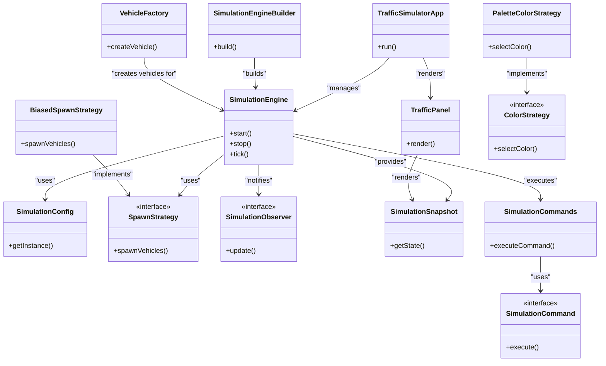

### 1. Reconciliation Summary

Based on the provided summaries, I have constructed a system architecture diagram for the traffic simulation application. The architecture is centered around the `SimulationEngine`, which manages the core simulation logic. The application employs several design patterns, including Strategy, Command, Observer, Factory, and Builder, to modularize and manage different aspects of the simulation. The `TrafficSimulatorApp` serves as the entry point, setting up the UI and starting the simulation loop. The `TrafficPanel` handles the rendering of the simulation, while `SimulationCommands` and `SimulationObserver` facilitate interaction and updates, respectively.

### 2. Updated Mermaid Diagram

### 3. Confidence Delta

- **TrafficSimulatorApp to SimulationEngine**: 0.9
- **TrafficSimulatorApp to TrafficPanel**: 0.9
- **SimulationEngine to SimulationConfig**: 0.9
- **SimulationEngine to SpawnStrategy**: 0.9
- **SimulationEngine to SimulationObserver**: 0.9
- **SimulationEngine to SimulationSnapshot**: 0.9
- **SimulationEngine to SimulationCommands**: 0.9
- **SimulationEngineBuilder to SimulationEngine**: 0.9
- **VehicleFactory to SimulationEngine**: 0.9
- **BiasedSpawnStrategy to SpawnStrategy**: 0.9
- **PaletteColorStrategy to ColorStrategy**: 0.9
- **TrafficPanel to SimulationSnapshot**: 0.9
- **SimulationCommands to SimulationCommand**: 0.9

This diagram reflects the architecture as described in the summaries, with confidence scores indicating the reliability of each connection based on the provided data.