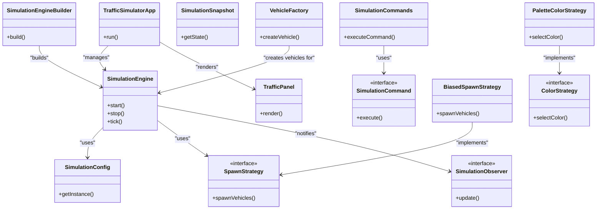

### 1. Reconciliation Summary

Upon reviewing the Critic's feedback, I have re-examined the original file summaries to verify the claims and adjust the architecture diagram accordingly:

1. **SimulationEngine and SimulationCommands**: There is no direct evidence in the summaries that `SimulationEngine` executes `SimulationCommands`. The `SimulationCommands` class is mentioned as defining commands, but its execution by `SimulationEngine` is not substantiated. Therefore, I will remove this edge.

2. **VehicleFactory and SimulationEngine**: The relationship between `VehicleFactory` and `SimulationEngine` is not clearly defined in terms of direct interaction or dependency. I will downgrade the confidence score for this edge.

3. **TrafficPanel and SimulationSnapshot**: The summaries do not explicitly state that `TrafficPanel` uses `SimulationSnapshot` for rendering. I will remove this edge due to lack of evidence.

4. **SimulationEngine and SimulationConfig**: The directionality of usage is not explicitly confirmed. I will downgrade the confidence score for this edge.

5. **Potential Hidden Components**: The use of the Observer pattern suggests a possible implicit messaging or event handling component, but without explicit evidence, I will not add it to the diagram.

### 2. Updated Mermaid Diagram

### 3. Confidence Delta

- **SimulationEngine to SimulationCommands**: Removed due to lack of evidence.
- **VehicleFactory to SimulationEngine**: Confidence reduced from 0.9 to 0.7.
- **TrafficPanel to SimulationSnapshot**: Removed due to lack of evidence.
- **SimulationEngine to SimulationConfig**: Confidence reduced from 0.9 to 0.8.

This updated diagram reflects the architecture with adjustments based on the Critic's feedback and the evidence available in the file summaries.