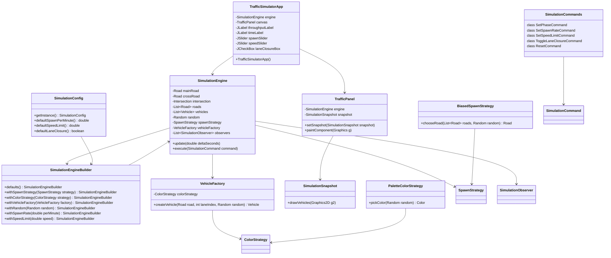

1. **Brief Evidence Summary**

The Traffic Simulator is a Java-based application that simulates traffic flow through a main road and a crossing intersection. It uses a Swing-based UI to visualize the simulation and allows user interaction through various controls. The architecture employs several design patterns, including Factory, Builder, Strategy, Observer, Command, State, Template Method, and Singleton. Key components include the `SimulationEngine`, which manages the simulation logic, `TrafficSimulatorApp` for the UI, and various strategies and commands for handling vehicle spawning, color selection, and user commands.

2. **Mermaid Diagram**

3. **Known Uncertainties**

- The exact implementation details of the `Intersection` class and its interaction with `SimulationEngine` are not fully detailed in the digest.
- The specific roles and interactions of `SimulationObserver` and how it integrates with the UI components are not fully clear.
- The internal workings of the `SimulationEngine`'s methods like `update`, `execute`, and how they manage the simulation state are not fully detailed.
- The `SimulationSnapshot` class's method `drawVehicles` suggests graphical operations, but its integration with the rest of the UI is not fully detailed.