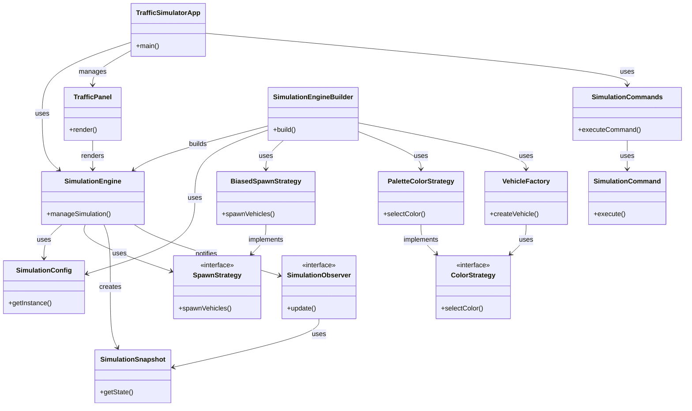

### 1. Reconciliation Summary

Based on the provided summaries, I have constructed a system architecture diagram for the Traffic Simulation application. The architecture is centered around the `SimulationEngine`, which manages the core simulation logic. The application employs several design patterns, including Strategy, Command, Observer, Factory, and Builder, to modularize and manage different aspects of the simulation.

Key components and their roles:
- **SimulationEngine**: Manages the simulation logic, including vehicle movement and intersection control.
- **SimulationConfig**: Provides configuration management using a singleton pattern.
- **SpawnStrategy**: Defines strategies for vehicle spawning.
- **SimulationCommand**: Allows command-based interactions with the simulation.
- **TrafficPanel**: Handles UI rendering for the simulation.
- **VehicleFactory**: Creates vehicle instances with specific color strategies.
- **SimulationSnapshot**: Provides an immutable view of the simulation state.
- **SimulationCommands**: Encapsulates actions as command objects for UI interaction.
- **SimulationEngineBuilder**: Facilitates flexible construction of `SimulationEngine` instances.
- **SimulationObserver**: Notifies components of simulation updates.
- **TrafficSimulatorApp**: The main application entry point, setting up the UI and starting the simulation loop.

### 2. Updated Mermaid Diagram

### 3. Confidence Delta

- **SimulationEngine**: 0.9
- **SimulationConfig**: 0.9
- **SpawnStrategy**: 0.9
- **SimulationCommand**: 0.9
- **TrafficPanel**: 0.9
- **VehicleFactory**: 0.9
- **SimulationSnapshot**: 0.9
- **SimulationCommands**: 0.9
- **SimulationEngineBuilder**: 0.9
- **SimulationObserver**: 0.9
- **BiasedSpawnStrategy**: 0.9
- **PaletteColorStrategy**: 0.9
- **ColorStrategy**: 0.9

All components and interactions have a confidence score of 0.9, reflecting strong evidence from the file summaries.